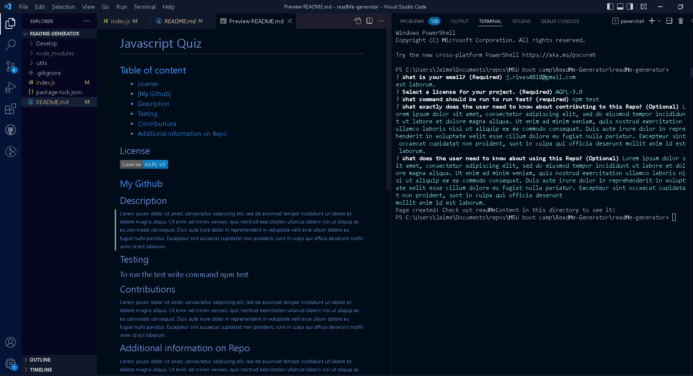

# Project Title: ReadMe Generator

## Project description: 

### Creating a Node.js app that will generate a unique Readme.md after user input

## 🛠 Technology used:
### - Javascript
### - Node.js

## Screenshots

## 🔗 Live demonstration
[Watch demonstration video here](https://drive.google.com/file/d/1_4MLQYtN8MCyzunzxcwE5q2ZyHTM7WQz/view)